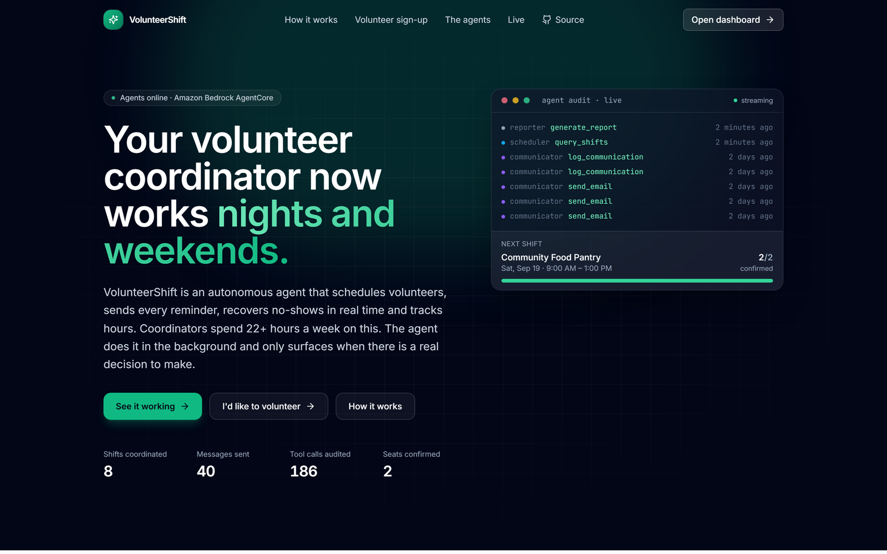
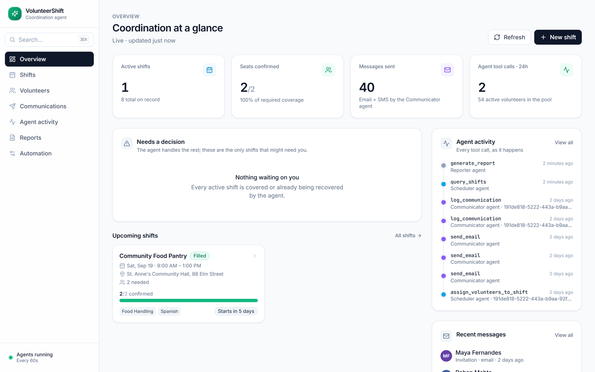
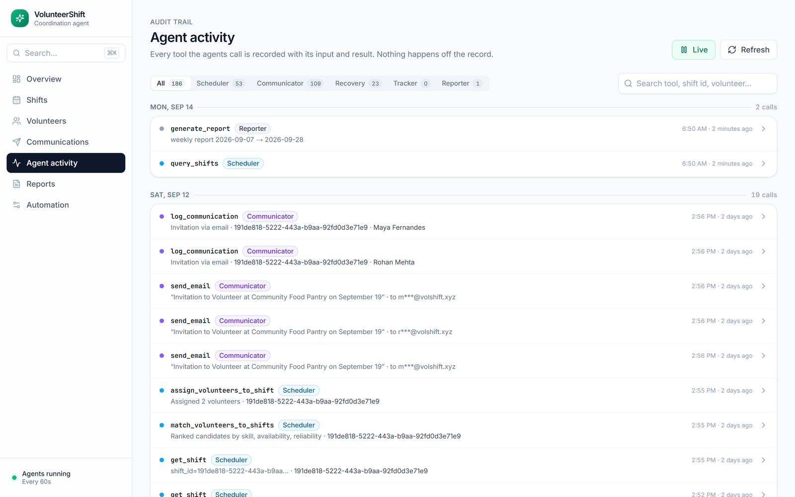
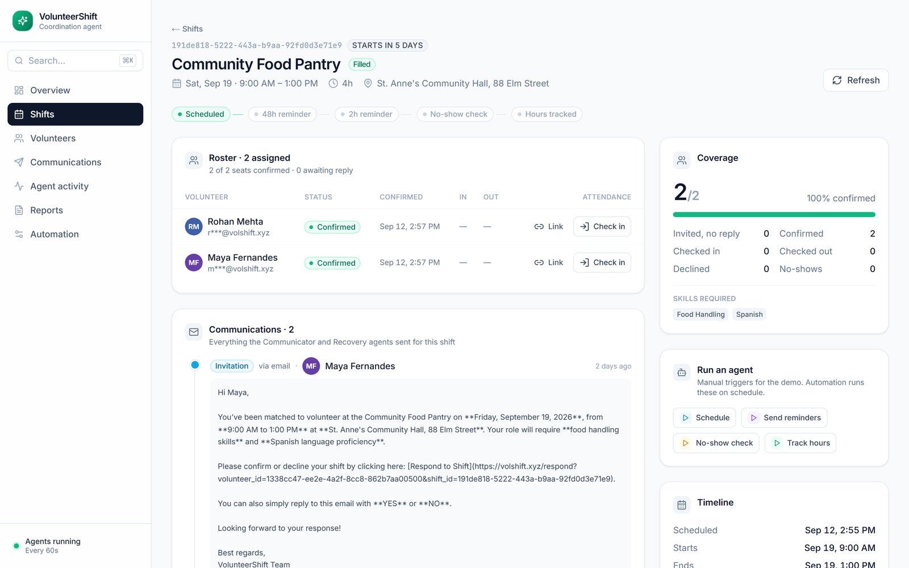
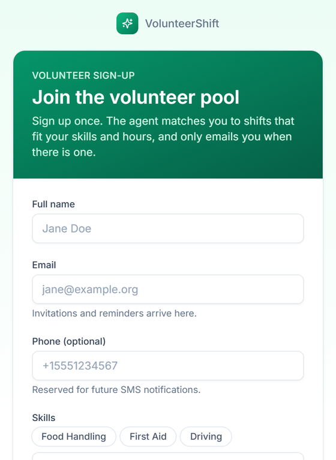
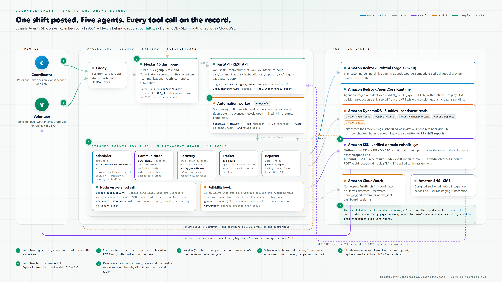

<div align="center">


# VolunteerShift

**An autonomous volunteer coordinator built on the Strands Agents SDK.**<br>
Post a shift and walk away. Five agents match, invite, remind, recover no-shows,
log hours and report — and every tool call they make is on the record.

[](https://volshift.xyz)


[**Open the live app**](https://volshift.xyz) ·
[Try it in two minutes](#try-it-in-two-minutes) ·
[How it uses Strands](#how-it-uses-strands-agents) ·
[Architecture](#architecture) ·
[Run it yourself](#run-it-yourself)



</div>

---

## Why

A volunteer coordinator at a mid-size nonprofit — a $500K–$10M budget and 50–500
volunteers — spends **22+ hours a week** on scheduling admin: matching people to
shifts, chasing replies, sending reminders, finding cover when someone doesn't show,
logging hours, and producing numbers for the board. None of it needs judgement. It
needs persistence, at 9 p.m. on a Friday, every week.

When that loop slips, reminders get missed, missed reminders become no-shows, and
no-shows become a short-staffed food line on Saturday morning.

**VolunteerShift takes the loop off the coordinator's plate.** They post a shift; the
agents run everything after it and surface only the shifts that genuinely need a
person.

## What it does

| When | Agent | What happens |
|---|---|---|
| Shift posted | **Scheduler** | Reads the shift, ranks the pool with the matching tool, assigns the best fits. |
| Right after assignment | **Communicator** | Emails each volunteer a personal invitation with their own signed one-tap `/respond` link, and logs every send. |
| Volunteer taps the link, or replies YES / NO | — | The assignment flips to confirmed and the shift fills. Email replies arrive through SES inbound → SNS → Lambda. |
| 48 h and 2 h before start | **Communicator** | Reminders to every confirmed volunteer. |
| Shift starts | worker | A staffed shift moves to `in_progress`. |
| `NOSHOW_THRESHOLD_MINUTES` after start (15 in production) | **Recovery** | Finds who hasn't checked in, contacts ranked replacements, alerts the coordinator. |
| Shift ends | **Tracker** | Logs hours, adjusts reliability (+0.02 attended, −0.15 no-show), closes the shift as `completed`. |
| On demand | **Reporter** | Weekly or monthly coverage, no-show rate and hours, stored in DynamoDB and S3. |

A background worker checks every shift every 60 seconds and runs whatever is due.
Each step is marked done on the shift record, so nothing runs twice, and a failed step
is retried on the next pass.

<table>
<tr>
<td width="50%" valign="top"><br><sub><b>Overview</b> — coverage is counted from confirmations, not assignments; only shifts that need a decision surface.</sub></td>
<td width="50%" valign="top"><br><sub><b>Agent activity</b> — every tool call with its input and result, live from the audit table.</sub></td>
</tr>
<tr>
<td width="50%" valign="top"><br><sub><b>Shift detail</b> — roster, lifecycle trail, the emails the agent wrote, manual agent triggers.</sub></td>
<td width="50%" valign="top" align="center"><br><sub><b>Volunteer sign-up</b> — public and phone-first; it feeds the pool the Scheduler matches against.</sub></td>
</tr>
</table>

## Try it in two minutes

Everything below runs against production at **[volshift.xyz](https://volshift.xyz)**.

1. **Join the pool.** Open [/signup](https://volshift.xyz/signup). Pick *Food Handling*,
   type `Spanish` under other skills, and tick *Saturday → Morning*.
2. **Post a shift.** [Dashboard](https://volshift.xyz/dashboard) → **New shift**: any
   Saturday 09:00–13:00, 1 volunteer, skills `food_handling` and `spanish`. Untick
   *"Open the shift and run the Scheduler agent right away"* so the background worker
   picks it up on its own.
3. **Watch the agents.** Open [Agent activity](https://volshift.xyz/activity). Within
   about two minutes, `get_shift` → `match_volunteers_to_shifts` →
   `assign_volunteers_to_shift` → `send_email` → `log_communication` appear at the top.
   Click any row for the exact input and result.
4. **Read what was sent.** Open the shift from [Shifts](https://volshift.xyz/shifts):
   the roster shows who was matched, and the Communications card shows the email the
   agent wrote.

> [!NOTE]
> Outbound email runs in the SES sandbox, so invitations reach verified inboxes only.
> Respond links are HMAC-signed and redacted from the console, so the one-tap confirm
> step is shown end to end in the demo video rather than from the console.

## How it uses Strands Agents

**Five agents, each with its own system prompt and tool subset,** drawing on 17
`@tool` functions in [`tools/volunteer_tools.py`](src/vshift/tools/volunteer_tools.py).

| Agent | Tools | Must call before it may stop |
|---|---|---|
| **Scheduler** | `get_shift`, `match_volunteers_to_shifts`, `assign_volunteers_to_shift`, `query_volunteers`, `query_shifts`, `get_volunteer` | `assign_volunteers_to_shift` |
| **Communicator** | `send_email`, `send_sms`, `log_communication`, `notify_coordinator` | `send_email`, `log_communication` |
| **Recovery** | `check_shift_coverage`, `match_volunteers_to_shifts`, `query_volunteers`, `get_shift`, `send_email`, `send_sms`, `log_communication`, `notify_coordinator` | `check_shift_coverage` |
| **Tracker** | `check_shift_coverage`, `get_shift`, `log_hours`, `update_volunteer_profile` | `log_hours` |
| **Reporter** | `query_shifts`, `generate_report` | `generate_report` |

**Hooks do the enforcement, not the prompt.**

- **`BeforeToolCallEvent`** cancels `send_email` / `send_sms` calls without a
  well-formed recipient and screens every tool input for SSN and card-number patterns
  ([`hooks.py`](src/vshift/agents/hooks.py)).
- **`AfterToolCallEvent`** writes the tool name, input, result and timestamp to the
  `vshift-audit` DynamoDB table. The console's
  [Agent activity](https://volshift.xyz/activity) page is a view of that table.
- **A reliability hook** tracks every tool call across the invocation. On
  `AfterInvocationEvent`, if a required tool never ran, it sets `event.resume` with a
  corrective instruction, up to twice. Models sometimes *describe* a tool call instead
  of making one; this closes that gap
  ([`reliability.py`](src/vshift/agents/reliability.py)).

**A graph for AgentCore, single actions for the worker.**
[`graph.py`](src/vshift/agents/graph.py) wires the five agents with `GraphBuilder`
(scheduler → communicator → recovery → tracker → reporter, 300-second execution
timeout), and [`agentcore_entry.py`](src/vshift/agentcore_entry.py) serves that graph
through `BedrockAgentCoreApp` for Amazon Bedrock AgentCore Runtime. The live VPS
deployment runs the same agents one lifecycle action at a time from the automation
worker, which keeps every run small, idempotent and separately auditable. Manual
triggers from the console go through the identical code path.

**The model.** Mistral Large 3 (675B) on Amazon Bedrock, through Strands'
`OpenAIModel` with `BedrockMantleConfig`, falling back to `BedrockModel`; transient
Bedrock errors are retried ([`model.py`](src/vshift/agents/model.py)).

**Give the agent the data, not the lookup.** The Communicator has no query tools. Its
caller pre-fetches each volunteer's address and signed respond link and puts them in
the task, so it cannot invent a recipient.

**Matching is a tool, not a guess.** `match_volunteers_to_shifts` requires every
listed skill and availability on the shift's weekday, skips anyone already assigned,
and ranks by reliability score, past participation in the same program, and logged
hours. The Scheduler is told to use it instead of filtering by day itself — a rule
added after a live run where the model computed the wrong weekday and matched nobody.

## Architecture



Volunteers and the coordinator both reach `https://volshift.xyz`, where Caddy
terminates TLS. The Next.js app serves the pages and proxies `/api/*` server-side to
FastAPI on `127.0.0.1:8000`. FastAPI owns the REST API and the 60-second automation
worker; both call the same Strands agents, which reason with Mistral Large 3 on Amazon
Bedrock and act through tools on DynamoDB, SES and S3, with custom metrics in
CloudWatch. Email replies come back through SES inbound → SNS → Lambda →
`POST /api/ingest/email-reply`.

## Security model

The live site doubles as a public demo, so the design is **sanitize, don't gate** —
with hard gates where they matter.

| Layer | Control |
|---|---|
| Network | The backend binds to `127.0.0.1`; only the dashboard proxy can reach it. Caddy serves TLS with HSTS. |
| API | Every route requires `X-API-Key` except sign-up, the respond pair, public stats and health. The proxy attaches the key server-side; the browser never sees it. |
| Respond links | `token = HMAC-SHA256(RESPOND_TOKEN_SECRET, "volunteer_id:shift_id")`, verified in constant time. Tokens are redacted from every response the console reads. |
| PII | Volunteer emails and phones are masked (`j***@example.org`, `+1***11`) and notes are dropped at the API boundary. Raw records stay in DynamoDB. |
| Abuse | Per-IP rate limits in the proxy: 10 a minute on sign-up and respond, 120 a minute overall. Errors reach the browser as generic messages. |
| Browser | Content-Security-Policy, `X-Frame-Options: DENY`, `nosniff`, strict referrer and permissions policies. |
| Agents | The `BeforeToolCallEvent` hook above. |

The coordinator console is intentionally reachable without a login so judges can use
it: anyone can run an agent from it, rate-limited, against masked data. Both secrets
fail open in local development, with a startup warning, so the project runs without
setup. Details and verification:
[security hardening notes](docs/changelog/2026-09/13-security-hardening/notes.md).

## Observability

Custom CloudWatch metrics in the `Vshift` namespace, a dashboard definition in
[`infra/cloudwatch`](infra/cloudwatch), and two alarms (`vshift-no-shows-detected`,
`vshift-no-communications`) created by
[`infra/scripts/setup-observability.sh`](infra/scripts/setup-observability.sh):

| Metric | Unit | Emitted when |
|---|---|---|
| `shifts_coordinated` | Count | The Scheduler assigns volunteers to a shift |
| `communications_sent` | Count | An email or SMS is sent |
| `no_shows_detected` | Count | Recovery detects a no-show |
| `no_shows_recovered` | Count | A replacement is found |
| `hours_logged` | None | The Tracker logs hours |
| `agent_action_failed` | Count | An automation action raises; it is retried on the next cycle |

## Run it yourself

### Prerequisites

- Python 3.10+ and Node.js 20+
- An AWS account with Amazon Bedrock access to Mistral Large 3 in `us-east-1`
- AWS credentials with DynamoDB, S3, SES, SNS and CloudWatch permissions
  (reference policy: [`infra/iam/vshift-role-policy.json`](infra/iam/vshift-role-policy.json))

### 1. Backend

```bash
git clone https://github.com/Sektorial12/VolunteerShift.git
cd VolunteerShift
python3 -m venv .venv
source .venv/bin/activate
pip install -r requirements.txt
cp .env.example .env
```

Edit `.env`:

| Variable | Purpose |
|---|---|
| `AWS_REGION`, `AWS_ACCESS_KEY_ID`, `AWS_SECRET_ACCESS_KEY` | AWS access |
| `AWS_BEARER_TOKEN_BEDROCK` | Bedrock API key (uses the Mantle endpoint; omit to use `BedrockModel`) |
| `BEDROCK_MODEL_ID` | Defaults to `mistral.mistral-large-3-675b-instruct` |
| `SES_SOURCE_EMAIL` | A verified SES identity, e.g. `coordinator@yourdomain.org` |
| `PUBLIC_DASHBOARD_URL` | Base URL volunteers open respond links on |
| `API_KEY` | Shared secret for `X-API-Key`; set the same value on the dashboard |
| `RESPOND_TOKEN_SECRET` | HMAC secret for respond links (`openssl rand -hex 32`) |
| `NOSHOW_THRESHOLD_MINUTES` | Minutes after start before Recovery runs (15 in production) |

Create the tables and seed 50 volunteers and 5 future-dated shifts:

```bash
export $(grep -v '^#' .env | xargs)
PYTHONPATH=src python -m vshift.utils.seed_data            # add --reset to wipe and reseed
aws s3 mb s3://your-vshift-reports                          # set S3_REPORTS_BUCKET to match
PYTHONPATH=src uvicorn vshift.api:app --reload --port 8000
```

### 2. Dashboard

```bash
cd dashboard
npm install
cp .env.example .env.local     # API_URL=http://localhost:8000, API_KEY=<same as backend>
npm run dev                    # http://localhost:3000
```

The browser never calls the backend directly: every request goes to the dashboard's
own `/api/*`, and a route handler forwards it to `API_URL` with the key attached.
Frontend details are in [`dashboard/README.md`](dashboard/README.md).

### 3. Email

SES sends from a verified domain identity. Until SES production access is granted the
account is in the sandbox, where every recipient must also be verified.

```bash
aws ses verify-domain-identity --domain yourdomain.org      # then add the DKIM records it returns
aws ses verify-email-identity --email-address you@example.com
```

Inbound replies ("reply YES or NO") use an SES receipt rule → SNS → Lambda bridge that
posts to `/api/ingest/email-reply`:

```bash
VSHIFT_API_BASE=https://your-host VSHIFT_API_KEY=<API_KEY> infra/lambda/deploy-ses-inbound.sh
```

SMS through `send_sms` is implemented, but delivery needs an AWS End-User Messaging
subscription and origination registration, so email is the live channel.

### 4. Trigger an agent by hand

```bash
curl -X POST http://localhost:8000/api/trigger \
  -H "Content-Type: application/json" \
  -H "X-API-Key: $API_KEY" \
  -d '{"action": "schedule", "shift_id": "s001"}'
```

`action` is one of `schedule` (also sends the invitations), `remind`, `noshow_check`,
`track` or `report` (no `shift_id`).

### 5. Tests

```bash
PYTHONPATH=src pytest tests --ignore=tests/test_integration.py -q   # no AWS needed
PYTHONPATH=src pytest tests/test_integration.py -q                  # against real AWS tables
```

## Deploy

- **VPS — the live deployment.** FastAPI and the automation worker run as a systemd
  service bound to `127.0.0.1`; the Next.js dashboard runs as a second service; Caddy
  serves both at `https://volshift.xyz` with automatic HTTPS.
- **Amazon Bedrock AgentCore Runtime.** Container image → ECR → runtime, including the
  account service-quota prerequisites, IAM policies and verification steps:
  [`infra/DEPLOYMENT.md`](infra/DEPLOYMENT.md).

## API reference

| Method | Path | Access | Description |
|---|---|---|---|
| GET | `/api/ping` | public | Health check |
| GET | `/api/public/stats` | public | Sanitized landing-page counters |
| POST | `/api/ingest/volunteer` | public | Volunteer sign-up (upserts by email) |
| GET | `/api/respond/context` | public, token | Minimal view for the respond page |
| POST | `/api/volunteers/respond` | public, token | Confirm or decline an invitation |
| GET | `/api/dashboard` | key | Active shifts, recent communications, totals |
| GET · POST | `/api/shifts` | key | List or create shifts |
| GET | `/api/shifts/{id}` | key | Shift detail |
| POST | `/api/shifts/{id}/checkin` · `/checkout` | key | Attendance |
| GET | `/api/volunteers` · `/api/volunteers/{id}` | key | Volunteers (masked) |
| GET | `/api/communications` | key | Messages sent (tokens redacted) |
| GET | `/api/audit` | key | Tool-call audit trail, newest first |
| GET | `/api/reports` · `/api/reports/{id}` | key | Reports |
| POST | `/api/trigger` | key | Run an agent action |
| POST | `/api/ingest/shift` | key | Ingest a shift from another system (dedupes) |
| POST | `/api/ingest/email-reply` | key | Apply an email reply (used by the Lambda bridge) |
| GET | `/api/automation/status` · POST `/api/automation/run` | key | Worker status, run a cycle now |

## Repository layout

```
src/vshift/
  agents/            five agent factories, prompts, GraphBuilder graph, hooks, reliability, model
  tools/             the 17 @tool functions (DynamoDB, SES, SNS, reports)
  api.py             FastAPI app, API-key middleware, public endpoints
  automation.py      60-second worker: due actions, lifecycle status
  security.py        HMAC respond tokens, API-key check, PII masking
  ingestion.py       shift and volunteer ingest, email-reply parsing
  agentcore_entry.py BedrockAgentCoreApp entry point around the graph
dashboard/           Next.js 15 console and public pages
infra/               AgentCore runbook, IAM policies, SES inbound Lambda, CloudWatch
tests/               unit, security and integration tests
docs/                architecture diagram, screenshots, changelog
```

## Built with

Strands Agents SDK · Amazon Bedrock (Mistral Large 3) · Amazon Bedrock AgentCore ·
Amazon DynamoDB · Amazon SES · Amazon SNS · AWS Lambda · Amazon S3 · Amazon CloudWatch ·
Python · FastAPI · Next.js 15 · React 19 · TypeScript · Tailwind CSS · Caddy

Built for the **AWS Agents for Humans** hackathon.

## License

[MIT](LICENSE)
